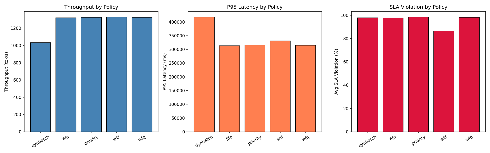

<div align="center">
  
# TASS
**Token-Aware Scheduling Simulator for LLM Inference**

[](https://goreportcard.com/report/github.com/AniketPatel148/TASS)
[](https://opensource.org/licenses/MIT)

*My personal sandbox for exploring the frontier of continuous batching, memory-aware scheduling, and LLM inference optimization.*

</div>

---

## The Vision

As LLMs scale, the true bottleneck has shifted from raw compute to **memory bandwidth** and **KV-Cache management**. **TASS** is a production-quality, discrete-event simulator built to explicitly model these granular dynamics. 

It replicates the architectural constraints faced by state-of-the-art inference engines (like vLLM, ORCA, and LightLLM) to experiment with custom scheduling policies under extreme, production-like load.

## Core Architecture

This simulator goes far beyond standard M/M/1 mathematical queuing models. It accurately mimics the token-by-token autoregressive decoding loop of modern hardware:

- **PagedAttention & Preemption**: Simulates dynamic, non-contiguous block-based memory allocation. It features a realistic Out-Of-Memory (OOM) admission controller that forces eviction and recomputation limits when KV-cache is physically exhausted.
- **Prefix Caching Hit-Rates**: Tracks prefix hits for shared prompts. Cached KV-blocks seamlessly bypass prefill computation latency during heavily concurrent continuous batching scenarios.
- **Advanced Schedulers**: Ships with standard `FIFO`, Tier-based `Priority`, `WFQ` (Weighted Fair Queuing), `SRTF` (Shortest Remaining Tokens First), and dynamic tail-latency aware batching algorithms out-of-the-box.
- **Bursty Workload Engine**: Directly simulates spiky, real-world API traffic via Poisson distributions, customizable burst periods, and deterministic CSV trace replays.

---

## Quick Start & Experiments

Get the engine running in seconds and plot the SLA violation differences when PagedAttention is enabled:

```bash
# 1. Build the simulator
go build ./cmd/tass

# 2. Run a heavily loaded Baseline FIFO scheduler (Static KV allocation)
go run ./cmd/tass --config experiments/s4_bursty/config.json --out out/baseline_fifo --verbose

# 3. Run the exact same load with PagedAttention and Prefix Caching enabled via SRTF
go run ./cmd/tass --config experiments/s4_bursty/config_paged.json --out out/paged_srtf --verbose

# 4. Generate visual comparisons across policies
python scripts/plot_results.py --dir out/ --compare
```

---

## Interpreting Results



Every simulation outputs pristine run summaries (`summary.json`) and granular per-request traces (`requests.csv`). Use these to track:

- **TTFT (Time to First Token)**: Absolute system responsiveness (Lower is better).
- **P95/P99 Latency**: Absolute tail latencies measuring worst-case inference distributions.
- **SLA Violation %**: Fraction of requests breaching hard tier-based SLA thresholds.
- **Fairness Index**: Jain's fairness index enforcing tier proportionality (1.0 = perfectly fair).
- **Throughput (tok/s)**: Total KV tokens successfully emitted per second of simulation uptime.

## Extending: Non-Linear GPU Calibration

TASS allows custom injection of hardware profiles. The mathematical timing model lives in [`internal/model/timing.go`](internal/model/timing.go). To calibrate with real clusters (e.g., A100s/H100s):

1. Profile your hardware with varying batch sizes and context lengths using Nsight Compute.
2. Fit the architectural bounds: `base_ms`, `per_token_ms`, `per_batch_ms`.
3. Subclass the `TimingModel` with non-linear roofline equations!

## Testing

```bash
go test ./...
```

## License

MIT
